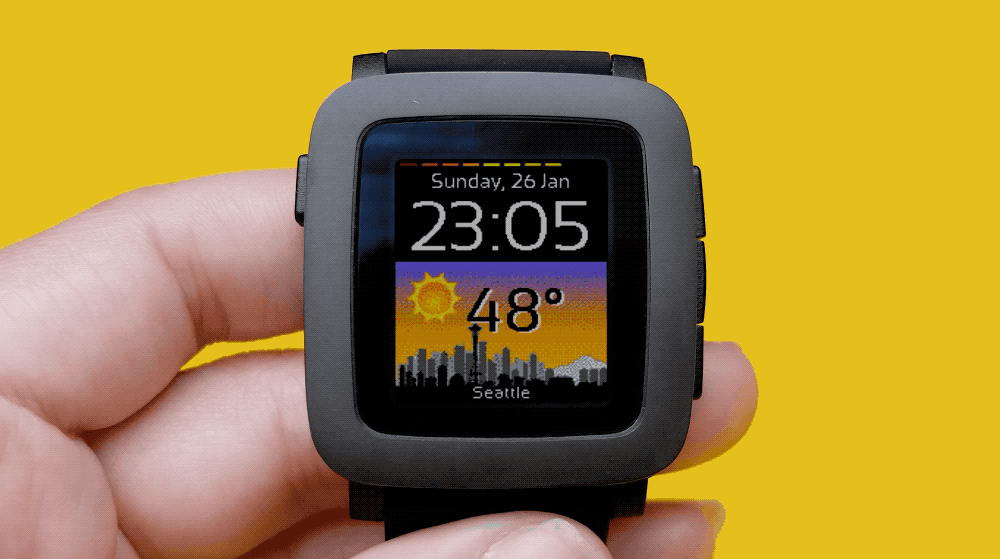

# pebble-citytemp

Temperature watchface for the Pebble smart watch. Uses GPS from bluetooth connected smartphone to query [Open Weather Map](https://openweathermap.org/) to get local temperature and conditions. Comes with graphics for 9 different weather conditions and 40 different cities.

Compatible with the Pebble Classic, Steel, Time, Time Steel, and Time Round watches. Consult the official [Rebble HowTo guide](https://rebble.io/howto/) for installation instructions.

---

### Configuration

Use the bundled smartphone config page to set the following settings.

#### Weather

##### Use GPS

True / False (default: true)

##### Temperature Units

Fahrenheit / Celsius (default: Fahrenheit)

##### City / Zip Code

(default: none)
**NOTE:** City or Zip must be set if "Use GPS" is false.

#### Display

##### Temperature Format

Large / Small / None (default: Large)

##### City

(default: Blank)

- Random
- Athens
- Auckland
- Beijing
- Berlin
- Bishkek
- Bogota
- Brisbane
- Calgary
- Canberra
- Chicago
- Delhi
- Dubai
- Dublin
- Hong Kong
- London
- Los Angeles
- Madrid
- Melbourne
- Milan
- Moscow
- New York
- Paris
- Portland
- Rio de Janeiro
- Rome
- Rotterdam
- San Francisco
- Seattle
- Seoul
- Shanghai
- Singapore
- St. Petersburg
- Sydney
- Tokyo
- Toronto
- Vancouver
- Washington DC
- Wellington

##### Big Time

True / False (default: False)

#### Vibration

##### Bluetooth vibration

True / False (default: False)

##### Hourly vibration

True / False (default: False)
